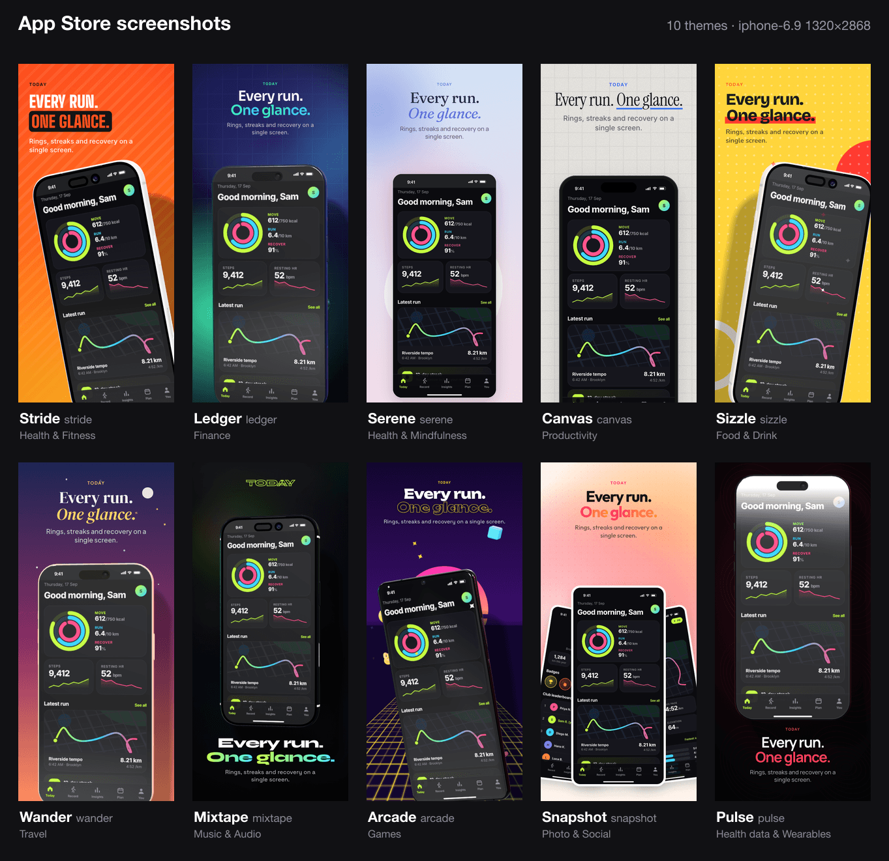
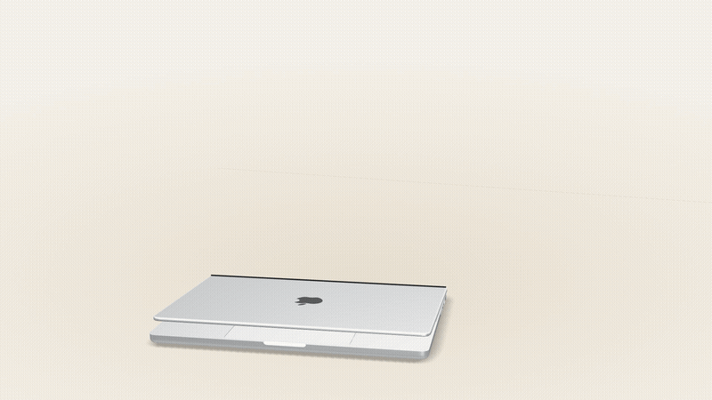
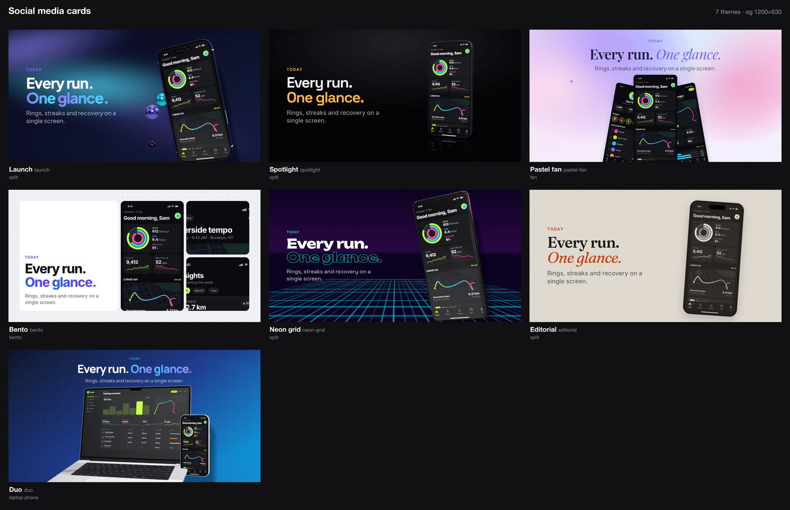
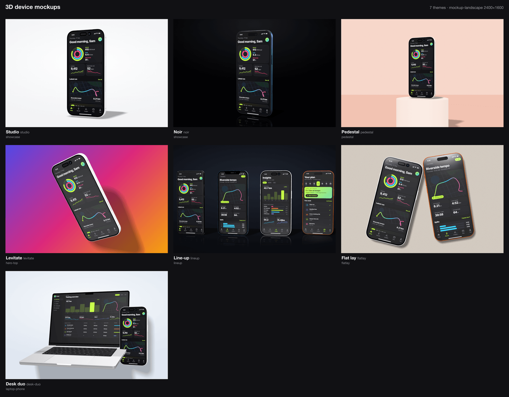
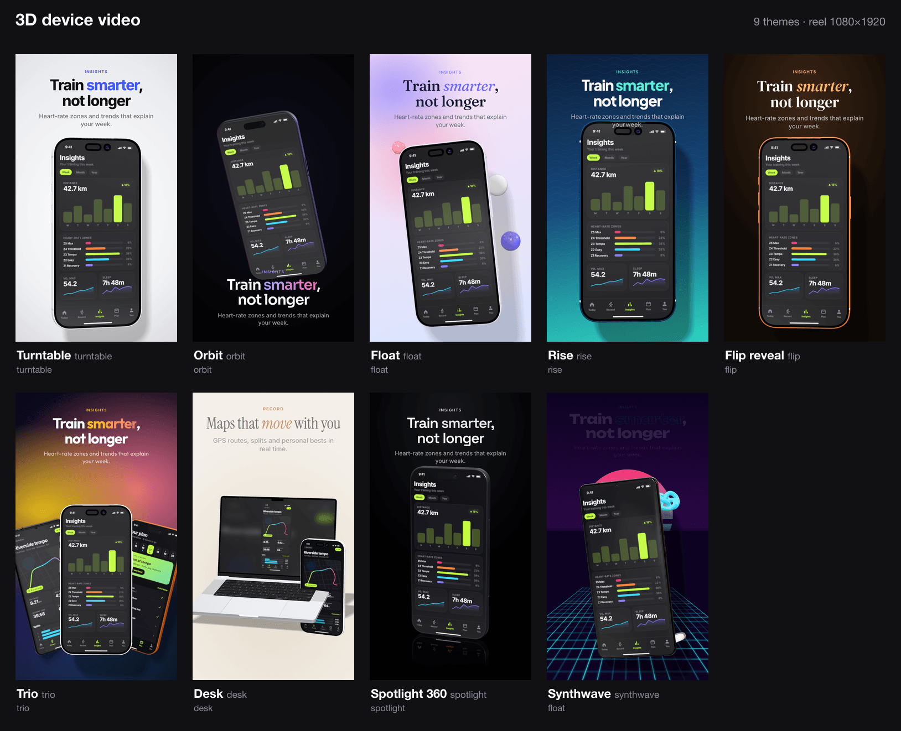
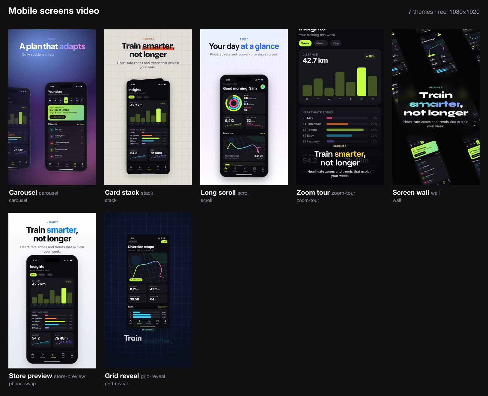
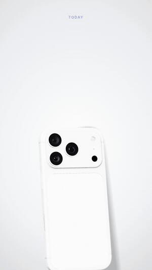
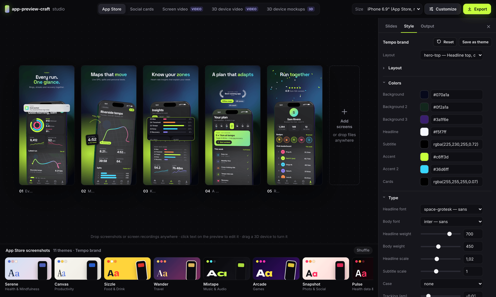

# App Preview Craft

[](https://github.com/imshaikot/app-preview-craft-skill/actions/workflows/validate.yml)
[](https://github.com/imshaikot/app-preview-craft-skill/releases)
[](LICENSE)
[](https://agentskills.io)

An [Agent Skill](https://agentskills.io) that turns your app's screenshots and screen recordings
into **App Store / Play Store screenshots, social cards, 3D device mockups and promo videos** —
rendered locally with headless Chrome, three.js and ffmpeg.



| 3D `trio` video | 3D `desk` video |
| --- | --- |
|  |  |

## Install

| Agent | Install |
| --- | --- |
| **Claude Code** (plugin) | `claude plugin marketplace add imshaikot/app-preview-craft-skill`<br>`claude plugin install app-preview-craft@app-preview-craft` |
| **Claude Code** (skill folder) | `git clone --depth 1 -b skill https://github.com/imshaikot/app-preview-craft-skill.git ~/.claude/skills/app-preview-craft` |
| **Codex · Cursor · GitHub Copilot · Gemini CLI · OpenCode · Amp · Goose** | `git clone --depth 1 -b skill https://github.com/imshaikot/app-preview-craft-skill.git ~/.agents/skills/app-preview-craft` |

Inside Claude Code, run `/plugin marketplace add imshaikot/app-preview-craft-skill`, then
`/plugin install app-preview-craft@app-preview-craft` as a separate command. For a single
project, clone into `.claude/skills/` or `.agents/skills/` instead. Update a clone with
`git -C <dir> pull --ff-only`.

**Requirements:** Node 20+, Chrome / Chromium / Edge with WebGL, and ffmpeg for video. On
first use the agent runs `node scripts/doctor.mjs --fix`, which installs the skill's npm
packages (~95 MB) and checks the rest.

## What it makes

| Category | Output | Themes |
| --- | --- | --- |
| `app-store` | Screenshot sets at every App Store Connect / Play size | 10 |
| `social-card` | Open Graph, X, LinkedIn, Instagram and story cards | 7 |
| `screen-video` | 2D motion from screens and recordings, incl. App Store previews | 7 |
| `device-video` | 3D iPhone, Galaxy and MacBook showcase videos | 9 |
| `device-mockup` | 3D hero stills, optionally transparent | 7 |

App Store themes borrow the look of popular apps in each store category (mood only, no brand
assets): `stride` fitness, `ledger` finance, `serene` mindfulness, `canvas` productivity,
`sizzle` food, `wander` travel, `mixtape` music, `arcade` games, `snapshot` photo, `pulse`
health data.

| | |
| --- | --- |
|  |  |
|  |  |



## Use

Ask your agent:

> Make App Store screenshots from `./screenshots` — it's a budgeting app.
>
> Turn `demo.mov` into a 3D phone video for Instagram.
>
> Make an og image and an X card for the launch.

Or run the CLI yourself (`$SKILL` is the install folder):

```sh
node $SKILL/scripts/cli.mjs app-store shots/*.png --theme ledger --size iphone-6.9,ipad-13
node $SKILL/scripts/cli.mjs device-video home.png demo.mov --theme turntable
node $SKILL/scripts/cli.mjs social-card home.png --theme launch --size og,x-post
node $SKILL/scripts/cli.mjs gallery app-store     # preview every theme
node $SKILL/scripts/cli.mjs list options          # every --set path
```

Any theme property can be overridden with `--set path=value`, a theme file that `extends` a
built-in, or an `app-preview-craft.json` project file
([example](skills/app-preview-craft/examples/app-preview-craft.json)). Files are written to
the current directory.

**Studio** — `node $SKILL/scripts/cli.mjs studio` opens a local, preview-first editor with
drag-and-drop screens, inline copy editing, live 3D and one-click export.



## Credits

The 3D device models are **CC-BY-4.0**; every render that shows one writes a `CREDITS.txt`.
Keep the credit when you publish.

- [iPhone 17 Pro](https://sketchfab.com/3d-models/iphone-17-pro-4541aa8a28324b33a2baaf81d263aaec) by Ranguel
- [iPhone 17 Pro Max](https://sketchfab.com/3d-models/iphone-17-pro-max-87fc1df741384124a8ce0226d2b2058d) by MajdyModels
- [iPhone 12 Pro](https://sketchfab.com/3d-models/iphone-12-pro-05dfc991665e45c68c8b7062136c0c6e) and [Galaxy S21 Ultra](https://sketchfab.com/3d-models/samsung-galaxy-s21-ultra-cd962832be7744efb6b37fe0ee2027e7) by DatSketch
- [MacBook Pro M3 16"](https://sketchfab.com/3d-models/macbook-pro-m3-16-inch-2024-8e34fc2b303144f78490007d91ff57c4) by jackbaeten

Device names are trademarks of their owners. Fonts: [Fontsource](https://fontsource.org) (OFL).

## License

MIT for the code; the device models keep their CC-BY-4.0 license.
